# When to Use C++

Before you write a single line of C++, ask yourself one question: **Do I really need it?**

C++ adds complexity. Use it only when it provides a *meaningful* impact.

!!! tip "The Golden Rule"
    Only use C++ for real performance bottlenecks that can't be solved with existing Python tools like NumPy or Numba.

## 🧠 The Decision-Making Flowchart

Here's a simple flowchart to guide your decision:

```mermaid
graph LR
    A[Start] --> B{A good Python library exists?};
    B -- ✅ Yes --> C[Use it!];
    B -- ❌ No --> D{Is it a real performance bottleneck?};
    D -- ❌ No --> E[Stick with Python];
    D -- ✅ Yes --> F{Can it be optimized with NumPy/Numba?};
    F -- ✅ Yes --> G[Use NumPy/Numba];
    F -- ❌ No --> H[🚀 Write it in C++];
```

## ✅ Good Use Cases

When does C++ make sense? Here are a few examples:

| Use Case | Why C++? | Example |
| :--- | :--- | :--- |
| **Non-Maximum Suppression** | Tight loops over thousands of boxes | `nextcv.postprocessing.nms` |
| **Hungarian Algorithm** | Complex algorithm with O(n³) complexity | `scipy.optimize.linear_sum_assignment` |
| **Low-Level Hardware** | Direct memory access for sensors/GPIO | Interfacing with custom hardware |

## 🚩 Common Pitfalls

Avoid these common traps:

| Pitfall | Description | Better Approach |
| :--- | :--- | :--- |
| 🏃‍♂️ **"C++ is always faster!"** | Assuming C++ is a magic bullet. | **Profile first.** Get concrete numbers. |
| 🔧 **Reinventing the Wheel** | Writing C++ for a solved problem. | Check SciPy, NumPy, and other libraries first. |

## ✅ Final Checklist

Use this checklist before you start writing C++:

- [ ] No good Python library exists for the task.
- [ ] Profiling shows a clear, measurable bottleneck.
- [ ] The bottleneck is a real issue in production.
- [ ] C++ will provide a significant (e.g., >5x) speedup.
- [ ] The team is comfortable maintaining the C++ code.

If you can't check all these boxes, stick with Python. 🐍
